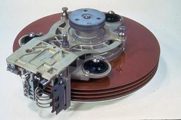

# Historique du disque dur
## Au commencement
 
    
Figure 1 - Disque dur IBM 305 et un l’un de ses plateaux
Les disques durs ont une histoire de plus de 60 ans. Le tout premier disque dur a été créé en 1956 par IBM, avec l’IBM 305 qui équipait l’ordinateur 305 RAMAC « Random Access Method of Accounting and Control ».  Il était doté d’une capacité de 5 Mo répartie sur 50 plateaux, le tout pour une masse d’une tonne. Les données étaient alors échangées avec un débit de 8,8 ko/s. Malgré son coût de 50 000 $ US, un millier d’exemplaires se sont écoulés en 5 ans. 
En guise de comparaison, les disques actuels possèdent souvent une capacité de 3 To à 4 To répartie sur des plateaux de 1 To, pour une masse inférieure à un kilogramme sur la balance. Les données sont échangées au rythme de 12 Gbits/s. Leur coût est l’ordre de la centaine d’euros.

## Les premières évolutions

Dans les années suivantes, des améliorations sont apportées, avec entre autres l’utilisation de roulement à bille et l’apparition des premières têtes à base de ferrite. Grâce à ses innovations, le disque dur gagne en parts de marchés et remplace les technologies de stockage sur cassette utilisées à l’époque. 
L’IBM 3340 sort en 1973. Il est constitué de deux plateaux de 30 Mo, ce qui qui lui a valu par analogie avec le fusil Winchester 30/30 le surnom de Winchester. L’appellation Winchester perdure de nos jours pour désigner le type de disque dur qui équipe nos PC.
Les évolutions de 1975 à 1991
Afin d’améliorer les temps d’accès des disques durs, les fabricants ont cherché à réduire la distance entre le plateau et la tête. NE 1979, cette distance était de 330 nanomètres, et atteignait une dizaine de nanomètres vers 2006. Dans le même temps, les taille des plateaux ont diminué. Les plateaux des disques du RAMAC mesuraient 24 pouces. EN 1979 cette taille est passée à 8 pouces, soit environ 20 centimètres. Cette miniaturisation a permis l’intégration du disque dur dans des systèmes plus petits. Ce support de stockage était réservé aux ordinateurs centrales, dits mainframe. Le premier micro-ordinateur commercialisé par IBM en 1975 ne comportait pas de disque dur. Ce n’est qu’en 1983 qu’un premier PC sera pourvu d’un disque dur.
