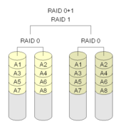
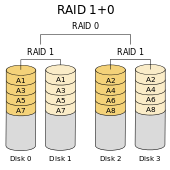

# Technologie RAID

## Principe

Le RAID (Redundant Array of Independent Disks) est une technologie dont le but est d'améliorer les performances et / ou la tolérance aux fautes du système de stockage. Elle prepose sur une virtualisation du stockage sur plusieurs disques (magnétiques ou SSD). Le RAID peut être géré par un contrôleur dédié (on parle alors de RAID matériel) ou par le processeur de l'ordinateur (RAID logiciel). Les performance (débits, vitesse général de l'orindateur) sont généralement meilleurs dans le premier cas. Il existe également des  configurations intermédiaires ou le contrôleur ne prend en charge qu'une partie des opérations et où le processeur central est nécessaire.

Il existe plusieurs modes RAID qui diffèrent dans leur façon d'utiliser les différents disques constituant le grappe de stockage, ce qui immplique des performances différentes. Dans ce qui suit, nous allons aborder certains de ces modes et en présenter leurs principales caractéristiques.

## Modes « simples » : 0 et 1

 

*RAID 0*

 

*RAID 1*

## Modes « composites »

 

*RAID 0+1*

 

*RAID 1+0*

## Un compromis : RAID 5

 

*RAID 5*
