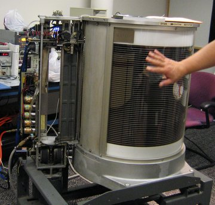
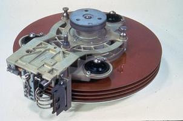
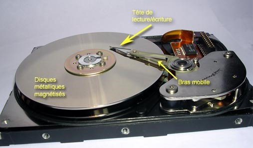
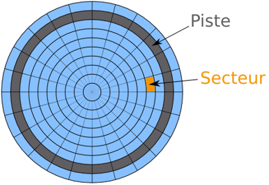
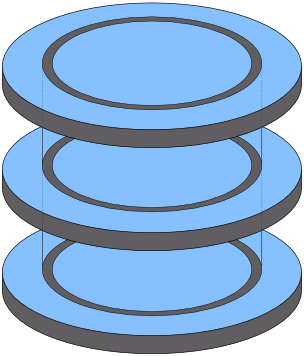
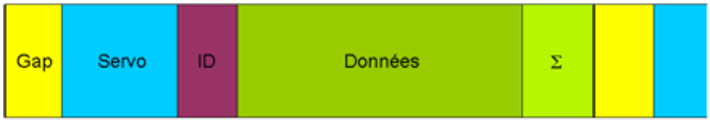
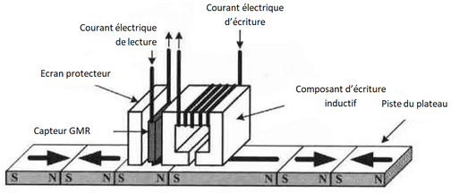
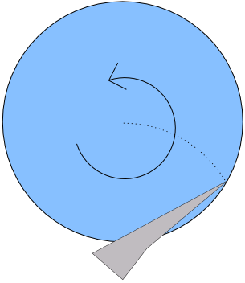
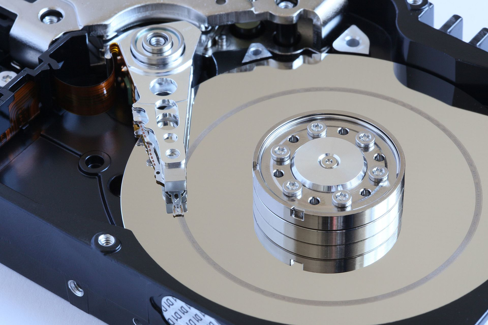

# Fonctionnement physique du disque dur

## Un peu d'histoire

### Au commencement
 
 

*Disque dur IBM 305*

Les disques durs ont une histoire de plus de 60 ans. Le tout premier disque dur a été créé en 1956 par IBM, avec l’IBM 305 qui équipait l’ordinateur 305 RAMAC « Random Access Method of Accounting and Control ».  Il était doté d’une capacité de 5 Mo répartie sur 50 plateaux, le tout pour une masse d’une tonne. Les données étaient alors échangées avec un débit de 8,8 ko/s. Malgré son coût de 50 000 $ US, un millier d’exemplaires se sont écoulés en 5 ans. 
En guise de comparaison, les disques actuels possèdent souvent une capacité de 3 To à 4 To répartie sur des plateaux de 1 To, pour une masse inférieure à un kilogramme sur la balance. Les données sont échangées au rythme de 12 Gbits/s. Leur coût est l’ordre de la centaine d’euros.

### Les premières évolutions

*Le disque dur IBM 3340 alias Winchester*

Dans les années suivantes, des améliorations sont apportées, avec entre autres l’utilisation de roulement à bille et l’apparition des premières têtes à base de ferrite. Grâce à ses innovations, le disque dur gagne en parts de marchés et remplace les technologies de stockage sur cassette utilisées à l’époque. 
L’IBM 3340 sort en 1973. Il est constitué de deux plateaux de 30 Mo, ce qui qui lui a valu par analogie avec le fusil Winchester 30/30 le surnom de Winchester. L’appellation Winchester perdure de nos jours pour désigner le type de disque dur qui équipe nos PC.

### Les évolutions de 1975 à 1991

Afin d’améliorer les temps d’accès des disques durs, les fabricants ont cherché à réduire la distance entre le plateau et la tête. NE 1979, cette distance était de 330 nanomètres, et atteignait une dizaine de nanomètres vers 2006. Dans le même temps, les taille des plateaux ont diminué. Les plateaux des disques du RAMAC mesuraient 24 pouces. EN 1979 cette taille est passée à 8 pouces, soit environ 20 centimètres. Cette miniaturisation a permis l’intégration du disque dur dans des systèmes plus petits. Ce support de stockage était réservé aux ordinateurs centrales, dits mainframe. Le premier micro-ordinateur commercialisé par IBM en 1975 ne comportait pas de disque dur. Ce n’est qu’en 1983 qu’un premier PC sera pourvu d’un disque dur.

## Les principaux composants du disque dur magnétique
 

*Disque dur "disséqué"* 

Le disque dur est contenu dans un boîtier étanche contenant une atmosphère protectrice destiné à éviter la présence de corps étrangers qui pourraient avoir un effet dévastateur sur le fonctionnement du dispositif.
On peut répartir les consituants du disque dur magnétique en deux catégories: 
* les éléments mécaniques :
  * plateaux magnétisés,
  * têtes de lecture (situées sur un bras mobile),
  * boîtier scellé,

* les composants électriques :
  * alimentation,
  * contrôleur de disque dur,
  * mémoire cache,
  * moteurs,
  * interface de communication.
 
## Disposition des informations

Un disque magnétique est composé d’un ou plusieurs plateaux métalliques (autrefois en aluminium ou en zinc, et de plus en plus souvent en verre) recouverts sur l’un des faces (ou les deux) d’une matière magnétisable. Les informations sont stockées dans des cellules correspondant chacune à un bit et dont l’orientation du champ magnétique indique s’il s’agit d’un « 0 » ou d’un « 1 ».

Les séquences de bits qui codent les informations stockées sont enregistrées sur des pistes circulaires sur chaque plateau ( contrairement aux disques optiques disposant d'un piste unique en spirale). Chacune de ces pistes est formée de secteurs. Ces pistes sont découpées en secteurs. Un secteur en plus de contenir les données enregistrées comporte également à la fin et au début des informations utilisées par le contrôleur de disque pour se repérer, ainsi qu’une somme de contrôle pour détecter d’éventuelles erreurs. Les  secteurs sont délimités lors du formatage de base niveau réalisé en usine (ou avec un logiciel spécifique). Les capacités de stockage des secteurs sont fréquemment de 512 ou 1 024 octets.

 
*Cylindres d'un disque dur*

L’ensemble des pistes situées à la même distance de l’axe sur les plateaux superposés forment ce qu’on appelle un cylindre. Historiquement, les secteurs d’un disque étaient repérés selon l’adressage CHS (abréviation de Cylinder/Head/Sector en anglais soit « Cylindre/Tête/Secteur » en français) aujourd’hui désuet (sauf lors du démarrage de l’ordinateur pour lire le MBR) du fait des limitations imposées sur la capacité (à environ 8 Go).

Les pistes étant concentriques, elles n’ont pas toutes la même longueur. Ceci a un impact sur le nombres de secteurs qui peut, selon le disque, être soit constant, soit augmenter à mesure que l‘on s’éloigne du centre du disque. Dans le premier cas, la densité d’enregistrement est plus élevée vers le centre du disque. Cependant, la vitesse angulaire étant constante, la tête de lecture voit passer autant de bits quelque soit sa distance avec le centre du disque. Dans le second cas, la quantité de données lues ou écrite est plus élevée vers le bord extérieur du disque. 

Un secteur contient plusieurs zones (dans l'ordre) :
1. une zone de "blanc" : il s'agit d'une zone inutilisée qui permet à la logique du contrôleur de basculer du mode lecteur au mode écriture et inversemement ; elle permet également de compenser de légères dérives de la vitesse de rotation des plateaux ;
2. une zone "servo" : elle contient des informations permettant de synchroniser la logique du contrôleur de disque avec les données qui vont défiler sous la tête de lecture juste après ; 
3. un en-tête : contient le numéro du bloc qui va suivre ce qui permet au contrôleur du disque de déterminer le numéro de secteur que la tête de lecture ou écrire, ainsi que de se recaler ;
4. les données utiles (512 à 1 024 octets) : ce sont celles stockées par l'utiliateur ;
5. une somme de contrôle : elle permet de détecter les erreurs.

## Lecture et écriture

### Principe de fonctionnement des têtes

Les informations sont stockées dans des cellules correspondant chacune à un bit et dont l’orientation du champ magnétique indique s’il s’agit d’un « 0 » ou d’un « 1 ». Les opérations de lecture et écriture sont réalisées à l’aide d’une tête de lecture constituée d’un bobinage fer /nickel. 
 

*Ecriture de donnée sur le disque dur*

Lors de l’écriture, un courant électrique est imposé dans le bobinage ce qui produit une magnétisation de la surface du disque dur. Selon le sens de ce courant, on obtient un « 0 » ou un « 1 ». Réciproquement, lorsque la tête de lecture passe au-dessus d’un zone magnétisée, un courant est induit dans la bobine. Le sens du courant est différent selon la valeur « 0 » ou « 1 » du bit stocké.
  
### Mouvements des têtes

 
*Tête de lecture parcourant le disque*

En fonctionnement, le disque tourne à une vitesse constante à une valeur allant généralement de 3 600 à 10 000 tr/mn voire 15 000 tr/min. Cette rotation est assurée par un moteur électrique autour d’un axe sur roulement à billes ou à huile. De leur côté les têtes de lecture décrivent un arc de cercle. Ainsi la combinaison de ces deux mouvements permet d’atteindre l’ensemble des données situées sur les surfaces réinscriptibles. 

Les têtes de lectures flottent au-dessus des plateaux en formant un coussin d’air grâce à leur géométrie. Le moteur qui les déplace doit pouvoir assurer des fortes accélérations et décélération. Une stratégie de commande des mouvements du bras porte-tête est d’accélérer au maximum puis de freiner au maximum pour que la tête se positionne à la position désirée. Un court délais est ensuite imposé afin de s’assurer que les vibrations engendrées par ce freinage s’estompent.

À l’arrêt, les têtes de lecture doivent être parquées, soit sur une zone spéciale (la plus proche du centre, il n’y a alors pas de données à cet endroit), soit en dehors des plateaux.
 

 
*"Atterrissage" des têtes sur le disque*

En cas d’entrée en contact d’une ou plusieurs têtes avec la surface des plateaux, il se produit un incident nommé « atterrissage » ayant généralement pour conséquence la destruction des données stockés sur la zone affectée. Du fat la faible distance entre la tête et le plateau, une impureté telle qu’une poussière aurait les mêmes conséquences fâcheuses. C’est pourquoi les disques durs sont assemblés en salle blanche et que leurs boîtiers sont scellés avec toute les précautions.

### Temps d’accès à l’information

Afin de lire ou écrire une information enregistrée sur le disque, il faut tout d’abord commencer par placer la tête sur la bonne piste. Ensuite, le temps de positionnement sur le bon secteur est variable : dans le meilleur des cas, la tête est déjà situé sur le début du secteur et dans le pire elle doit attendre un tour complet du disque. En moyenne, cette durée correspond à celle nécessaire pour que le disque réalise un demi-tour. Enfin, on peut lire ou écrire le contenu. La durée de cette tâche est caractérisé par la vitesse de transfert de l’information ou débit. Celle-ci correspond à la quantité d’information défilant devant la tête par unité de temps, et donc de la densité d’enregistrement et de la vitesse de rotation du disque. 
Il apparaît clairement que pour avoir des durées d’écriture ou de lectures rapides, il est nécessaire que les données soient proches les unes des autres.  C’est l’utilité de l’opération de défragmentation qui consiste à utiliser un logiciel permettant de réorganiser le disque de telle manière que les données soient placées sur des secteurs contiguës.
Mémoire cache

Même avec des bonnes caractéristiques, le disque dur reste un système mécanique et donc très lent. Cela est pénalisant, en particulier lors de l’accès fréquents à de petits fichiers, ce qui est le cas en particulier pour le système d’exploitation. Déplacer les têtes de lecture pour ces fichiers à chaque fois réduirait la réactivité du système. C’est pour cela que les disques durs disposent pour la plupart d’une petite mémoire cache électronique servant à stocker les données les plus utilisés.
Contrôleur

Le contrôleur est en quelque sorte le cerveau du disque dur. Il commande les moteurs de rotation et positionne les têtes de lecture et enregistrement. Il assure également l’interface avec le bus en convertissant les signaux reçus des têtes en données exploitables, ou en enregistrement à un emplacement particulier de la surface des plateaux les données provenant du bus.

## Les interfaces /bus

ATA : nécessité de définir un maître et un esclave

